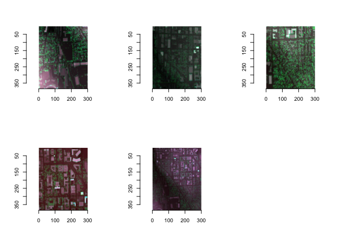

<!-- badges: start -->
[](https://opensource.org/licenses/)
[](https://codecov.io/github/land-info-lab/viewscape?branch=master)
[](https://github.com/land-info-lab/viewscape/actions/workflows/R-CMD-check.yaml)
<!-- badges: end -->


# viewscape

<p align="left">


</p>

## Introduction

The goal of viewscape package is to provide an accessible method of
carrying out landscape spatial analysis based on the viewshed within the
R environment. The viewscape R pacakge can currently be downloaded via
github.

``` r
library(devtools)

# load package
install_github("land-info-lab/viewscape")

# Load the package
library(viewscape)
```

The basic viewshed analysis can be accessed through calling the
`compute_viewshed`. The two needed objects are a digital surface model
(DSM) and a viewpoint. It provides flexibility for single or
multi-viewpoint analyses and allows options for parallel processing,
raster output, and plotting.

Based on the viewshed, a set of configuration metrics can be calculated
using `calculate_viewmetrics`, `calculate_diversity`, and
`calculate_feature`.

The metrics are including:

-   Number of patches: Visible fragmentation measured by total visible patches
    with the viewscape.
-   Mean shape index: Visible patchiness based on average perimeter-to-area ratio
    for all viewscape patches. 
-   Edge density: A measure of visible complexity based on the length of
    patch edges per unit area.
-   Patch size: Total average size of a patches over the entire viewscape area.
-   Patch density: Visible landscape granularity based on measuring patch density.
-   Extent: The total area of the viewshed, calculated as the number of
    visible grid cells multiplied by the grid resolution.
-   Depth: The furthest visible distance within the viewshed from the
    viewpoint.
-   Vdepth: The standard deviation of distances to visible points,
    providing a measure of the variation in visible distances.
-   Horizontal: The total visible horizontal or terrestrial area within
    the viewshed.
-   Relief: The standard deviation of elevations of the visible ground
    surface.
-   Skyline: Variation of (Standard deviation) of the vertical viewscape
    (visible canopy and buildings).
-   Shannon diversity index: Based on the number of land use/cover
    classes and the proportion of distribution.
-   Proportion of other object: Building, trees, or paved surface.

``` r
#Load in DSM
test_dsm <- raster::raster(system.file("test_dsm.tif", 
                                       package ="viewscape"))

#Load in the viewpoint
test_viewpoint <- sf::read_sf(system.file("test_viewpoint.shp", 
                                          package = "viewscape"))

#Compute viewshed
output <- viewscape::compute_viewshed(dsm = test_dsm, 
                                      viewpoints = test_viewpoint, 
                                      offset_viewpoint = 6, 
                                      plot=TRUE)

# Load DTM
test_dtm <- terra::rast(system.file("test_dtm.tif", 
                                       package ="viewscape"))

# load landuse raster
test_landcover <- terra::rast(system.file("test_landuse.tif",
                                           package ="viewscape"))

# Load canopy raster
test_canopy <- terra::rast(system.file("test_canopy.tif", 
                                       package ="viewscape"))

# Load building footprints raster
test_building <- terra::rast(system.file("test_building.tif", 
                                       package ="viewscape"))

# calculate metrics given the viewshed
test_metrics <- viewscape::calculate_viewmetrics(output, 
                                                 test_dsm, 
                                                 test_dtm, 
                                                 list(test_canopy, test_building))

# the Shannon Diversity Index (SDI)
test_diversity <- calculate_diversity(test_landcover, output, proportion = TRUE)
```

Baesd on the TNMAccess API, LiDAR search facilitate the retrieval and
exploration of LiDAR (Light Detection and Ranging) data (from USGS)
within a specified bounding box (bbox). This function enables users to
search for LiDAR data, preview available graphics, and optionally
download LiDAR data files for further viewscape analysis. Current
dataset of USGS covers the most area in the US:
<https://apps.nationalmap.gov/lidar-explorer/#/>

``` r
# search for lidar data information using bbox
search_result <- viewscape::lidar_search(bbox = c(-83.742282,42.273389,-83.733442,42.278724), preview = TRUE)
#> Find 5 items
```



From viewshed analysis, the visible area of a viewpoint is presented by
visible points. There are several viewshed metrics such as can be
calculated based on the visible points. For further information on these
metrics and the rest of the functions available in this package please
refer to the [package
website](https://land-info-lab.github.io/viewscape/). For more
information and examples of the functions check out the [package
vignette](https://github.com/land-info-lab/viewscape/blob/master/vignettes/viewscape.md).

## Note

The package currently does not support multi-core processing on Windows system. 
The function 'compute_viewshed' with 'parallel = TRUE' will automatically work
on single worker.

## Issues and bugs

This package may take a long time to run if using spatially large or
high resolution digital elevation models.

If you discover a bug not associated with connection to the API that is
not already a [reported
issue](https://github.com/land-info-lab/viewscape/issues), please [open
a new issue](https://github.com/land-info-lab/viewscape/issues/new)
providing a reproducible example.
